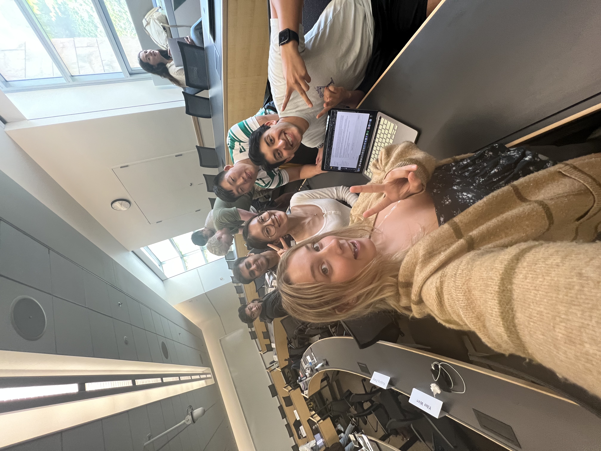

# About Us

## MBAngels

We are a team of Master of Business Analytics (MBAn) students with the goal of understanding how the new age of generative artificial intelligence (AI) will impact the world, and specifcally, impact our cohort as analytics students. By combining our wide array of backrounds, diverse skillsets, and range of persepctives, we hope to compile a robust report that captures the impact AI will have on all levels of industry.

## Manav Adwani

**Background:**
Manav studied commerce in his undergrad and comes from a family business background. After completing a relatively generic degree for his undergrad, he now wants to explore the true power of business when data analytics is applied to it. This would include learning more about the strategy side of analytics.

**Experience:**
While he is enthusiastic about learning the technical aspect, he hopes to provide an in depth business perspective to the team. The team can benefit from his experience in EY and his knowledge about setting up and running a successful international business as an entrepreneur.

## Sohil Apte 

**Background:**
Sohil is originally from Canton Ma, and graduated from the University of Michigan in 2023. With a BS in Computer Science and a concentration on artificial intelligence and machine learning, Sohil has a robust theoretical perspective of AI, and an understanding of the intricacies of machine learning applications. 

**Experience:**
As a former Computer Science student with practical experience as a Software/Machine Learning Engineer at a startup, his knowledge of machine learning model development and deployment, along with its business implications, offers insights into the real-world competitive impact of AI technologies.

## Lauren Brown

**Background:**
Lauren is from Brighton, Michigan and graduated from the school of LSA at the University of Michigan in 2023. Being a Psychology major, Lauren is interested in society’s reaction to AI and its outcomes.

**Experience:**
Lauren has experience in marketing, and has developed a passion for AI regulation as she recognized the potential for AI's powerful impact on the industry alongside the need for ethical guidelines to protect consumers and ensure fair practices.

## Anson Lee

**Background:**
Anson Lee is originally from Poughkeepsie, New York. He graduated with a BBA from the Ross School of Business in 2023. 

**Experience:**
His experience includes working in the operations departments of Goldman Sachs and Toyoda Gosei North America. He is also an avid cinephile and skier. Anson Lee is primarily concerned with how AI will be regulated to protect workers and industries.

## Xuexin Li

**Background:**
Xuexin is originally from Beijing, China. Xuexin studied in Business Management and Economics at UC Santa Cruz during her undergraduate years.

**Experience:** Xuexin has immersed herself in the Digital Marketing industry in China after graduation. Her experience has sparked a deep interest in exploring AI's transformative potential in reshaping marketing strategies and consumer behavior.

Our combined skills and shared passion for the topic make us uniquely equipped to tackle the questions surrounding AI and the impacts it will have on comeptition and strategy. We are excited to share our research and insights in this paper.

## Team Reflection

The culture of MBAngels evolved significantly over the course of the project. In the initial stages, our team was not a strong one, and our lack of coordination was apparent on our first in-class presentation. The disjointed nature of the assignment made it apparent we were not truly working as a team, and Professor Domagala made note of this when giving feedback. As a result, we decided to devote our next meeting to serious team-building to ensure our final project would be of a higher quality. Our first step was to ensure all members had a basic understanding of how to push to Git, so that we could all participate in writing the report. This was a long and frustrating process as we encountered numerous technical issues along the way, but eventually we were all able to make necessary changes to the website. 

Additionally, this meeting helped us build a culture and though not the intention of the meeting, helped establish psychological safety. By helping one another with RStudio, our team established norms for requesting and receiving help. MBAngels welcomed the statement “I don’t know how to solve this problem; I need help,” because it helped start discussions and ensured all members contributed to the overall progress. Our subsequent meetings also saw greater participation over time. To contrast with our initial, uncoordinated presentation, the final stages of this project saw our team read each section aloud as a group to check for errors, inconsistencies, or areas of improvement. The result has been a project that we are truly proud of, and we hope that Professor Domagala and Professor Kumar note our evolution as a team.

