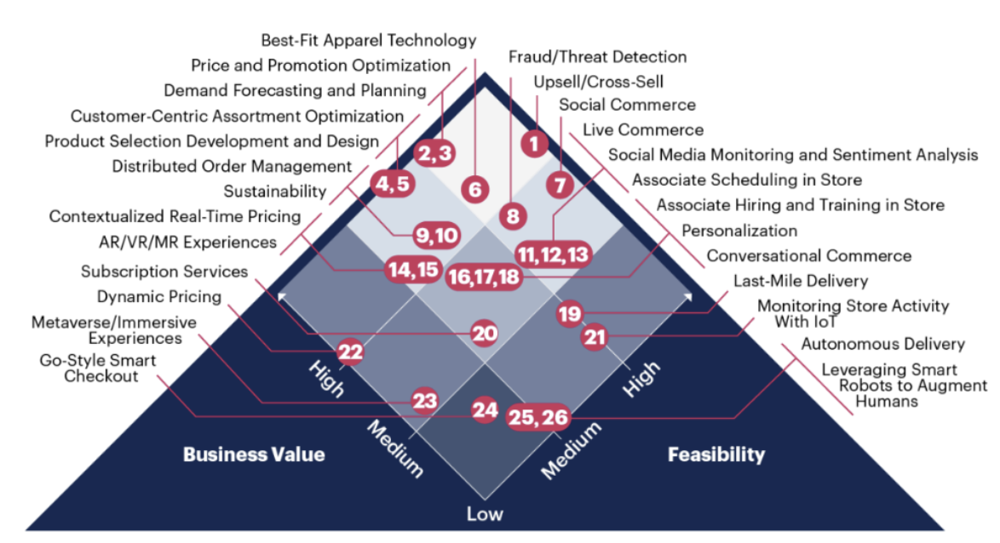

# Impact of AI on the Competitive Landscape

## “Feedback Loop”
From customer-targeted advertisements to automated chatbots, AI has found its place in every industry. The excellence of a modern business is often synonymous with the use of AI and related systems in its day-to-day operations. While AI is used in the back end and the front end, it is the customer-centric application of AI that helps businesses to gain a competitive advantage in any industry. 

A common misconception is that accessibility to data drives competitive advantages for businesses. Even regulators share the perspective that companies amassing large amounts of data can pose barriers for new entrants (Iansiti, 2021). The main concern is that the availability of excess data can result in a “feedback loop”. 

A feedback loop is formed when the companies with the most data use it to reinforce their decisions and deliver heightened value to their customers. As they grow their customer share, these companies inherit access to even more data, which can be used to make additional derivations. This is particularly true for younger companies, as acquiring data is a useful tool for building the user base necessary to take advantage of network effects. However, deeper research shows that this might not be the case for more mature firms, because the accumulation of data eventually yields diminishing returns. This is especially true when data lacks quality, scalability, or cannot be combined with complementary data. Also important is the degree to which data is exclusive and inimitable. This prevents rival firms from nullifying a data advantage through their own usage. For example, streaming services have been able to use similar data to Netflix to reduce its competitive data advantage. Clearly, the positive feedback loop is not infinite, and the usefulness of data has an implicit ceiling, making it a nuanced issue for regulators to tackle. 
 
## Competitive AI Across Industries:

With the mass adoption of AI by businesses, it was inevitable firms would attempt to achieve a competitive advantage via this technology. Applications for reducing cost and maximizing value have manifested across a diverse set of industries. However, the wide range of use cases makes it difficult to understand the complete effect of AI on the competitive relationship between businesses. Already, businesses use AI in a plethora of frontstage functions that are relevant for the consumers interacting with them and the workers that design them. Below are examples of some of the most significant users of AI technology:

## Media
Perhaps no industry is more concerned with its front-stage activities than the media industry. With the success of their products and services depending mainly on consumer perceptions, it makes sense for firms within the industry to utilize new technology to help ensure success. Even in its current state, AI is capable of generating content for media firms (Global Artificial Intelligence, 2019). It could also be used to modify existing content, through methods such as mimicking actor’s performances in a foreign language (Toonkel, Sharma, 2023).

AI could also be implemented in other front-stage functions. HBO has held discussions with OpenAI about the potential for using AI-generated descriptions of shows to display online (Toonkel, Sharma, 2023). Within streaming sites, the technology also has the ability to curate the user experience through recommendation algorithms. This has the benefit of creating individual user profiles that can be used as the basis for delivering the necessary content to attract and retain users.

However, the potential usage of AI has garnered massive backlash within the media industry. The ongoing writers’ and actors' strikes were in part caused by the fear that the technology would claim jobs and justify worsened working conditions. The challenge for leaders and workers within the media industry for the foreseeable future will be to settle on agreements regulating artificial intelligence usage. This will be key in leveraging the benefits of the technology while ensuring the industry can maintain relationships with its partners.

## Tech
The technology industry has been leveraging advancements in AI to assist in the innovative process. Firms are using this technology to create customer personas and create front stage systems, such as user interfaces, optimized through AI. The collection of data also helps technology firms design products better suited to customer demands, which has the potential to drive significant sales (Global Artificial Intelligence, 2019). The success of these data-driven initiatives has led firms to attempt to collect as much data as possible, but some studies have suggested that this activity eventually leads to diminishing returns.

Strategy in tech must be based on the quality and relativity of the data rather than just on the volume of data. In the tech industry, research has shown that the use of deep learning is much more accurate where the data sets are massive. However, research shows that this might not always be true. Herein, the systems developed to articulate data find it difficult to make any sense of “start data”. This data is often referred to as cold data which is too small to derive any meaningful explanation. However, as more data comes in, generally referred to as the “power-law” data, each additional data point helps to improve the performance of the algorithm. After a point, any additional data will not be of significant help to the algorithm (Iansiti, 2021). 
 
## Retail
In the retail industry, artificial intelligence is being utilized for customer-centered strategy. This would mean the use of various front-end targeting mechanisms such as the dynamic pricing mechanism, customer centric assortment optimization, and demand forecasting and planning. Dynamic pricing also works in tandem with the promotion optimization algorithm which helps determine what promotions should reach which customers (Hetu, 2022). AI is also increasingly leveraged in the Best-Fit Apparel algorithm which facilitates the customer in buying according to their style. It is evident that in order to stay competitive in the retail industry, companies must facilitate their operations through AI. 

This system is especially important in e-commerce due to the previously mentioned feedback loop. To attract enough users to sustain the business, firms like Amazon and Alibaba invest in them to attract users. As more buyers and sellers utilize their platforms, the feedback loop begins as new sources of data are now available. This is in part what makes e-commerce firms successful. Having consumer data they can analyze with AI and market accordingly.

One of the most effective ways retail businesses deploy AI is by upselling and cross-selling. These AI systems also have the benefit of being relatively easy to implement. In e-commerce, algorithms can be used to detect a competitor’s price and adjust one’s own accordingly (Hamer, Elliot, Hare, 2023). AI pricing is not limited only to online retailers though. Walmart has been testing robots that scan shelves to calculate stock and determine prices accordingly. In addition to serving as an example of price management, this system also shows how AI can limit the burden of work on employees who are now free to focus more on curating the in-store customer experience (Global Artificial Intelligence, 2019).

##Applications of AI

“AI can help to improve customer service by automating routine tasks and providing personalized recommendations.”
Satya Nadella, CEO of Microsoft

AI has already made significant inroads into customer service, with tools like chatbots and virtual assistants taking on a variety of customer-related tasks. Industry experts are predicting a number of trends in this area. The adoption of AI-powered chatbots is set to rise, with the global chatbot market projected to reach a substantial USD 27,297.2 million by 2030. This growth is expected to occur at a compound annual rate of 23.3% from 2023 to 2030. (Taylor, 2023) The advantages of chatbots are 24/7 availability and efficient handling of inquiries compared to human representatives. As chatbots continue to evolve, they are becoming increasingly sophisticated, capable of addressing both straightforward queries and complex issues. This advancement is proving to be important for customer service teams seeking streamlined interactions.

The progression of AI is also leading to a shift towards more personalized customer experiences. Insights from the State of AI report underscore that people are growing more comfortable with AI's ability to offer personalized messages (50%) and tailored experiences (46%) (Taylor, 2023). Leveraging customer data, AI is now capable of providing customized product recommendations and interactions that enrich the overall customer journey.

Furthermore, AI's predictive capabilities are expected to become more advanced. With enhanced accuracy, AI will be able to predict customer behaviors with precision, resulting in improved customer experiences and heightened satisfaction levels. For instance, AI systems can anticipate when a customer is likely to make a purchase based on their historical behavior and interactions. This predictive ability opens the door for timely actions, such as delivering personalized offers at opportune moments.

Debates about AI's role in customer service will continue. While some analysts envision AI completely replacing human representatives, others anticipate a collaborative relationship between AI and human agents. Research data indicates that by 2024, approximately 61% of customer service professionals will rely on AI or other automated processes. (Taylor, 2023) Although AI excels at handling a diverse range of queries, situations demanding human empathy and understanding are expected to persist. These ongoing discussions reflect the evolving landscape of customer service and the dynamic interplay between technology and human expertise.
